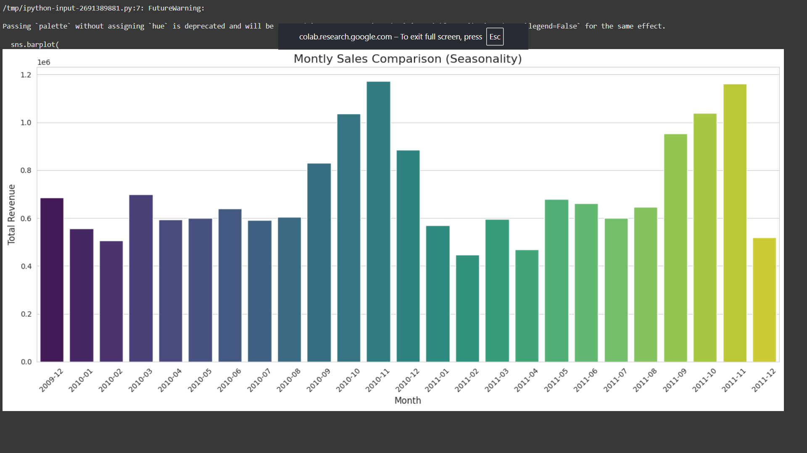
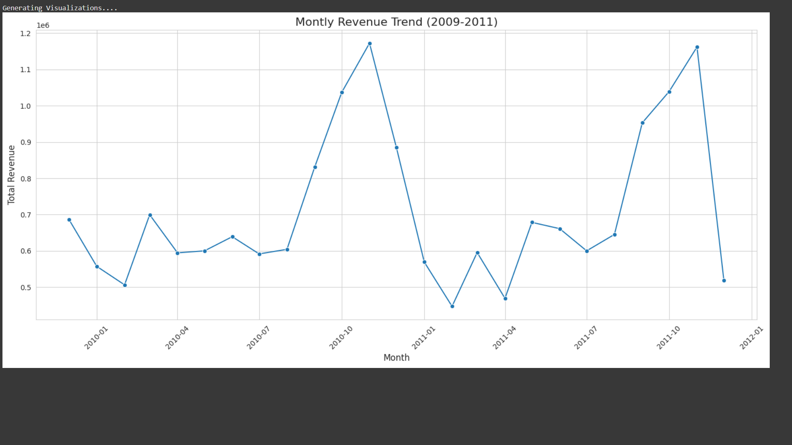

# E-Commerce Sales Analysis

An analysis of transactional data from a UK-based online retailer to identify revenue trends and seasonal patterns using Python, Pandas, and Seaborn.

![Sales Trend Plot]
*(Self-note: After uploading, replace the line above with a screenshot of your actual plot!)*

---

## 🚀 Overview

This project cleans, processes, and analyzes over two years of e-commerce data. The primary goals were to:
* Calculate and visualize monthly revenue trends.
* Identify seasonal sales patterns.
* Demonstrate data cleaning and feature engineering techniques with Pandas.

---

## 🛠️ Technologies Used

* **Python**: Core programming language.
* **Pandas**: For data manipulation and analysis.
* **Seaborn & Matplotlib**: For data visualization.
* **Jupyter Notebook**: For interactive development.

---

## 📋 Setup and Installation

To run this analysis on your own machine, follow these steps:

1.  **Clone the repository:**
    ```bash
    git clone [https://github.com/1dhanshree/ecommerce-sales-analysis.git](https://github.com/1dhanshree/ecommerce-sales-analysis.git)
    cd ecommerce-sales-analysis
    ```

2.  **Install dependencies:**
    ```bash
    pip install -r requirements.txt
    ```

3.  **Download the dataset:**
    The dataset used is the "Online Retail II UCI" dataset. You can download it from Kaggle:
    [https://www.kaggle.com/datasets/mashlyn/online-retail-ii-uci](https://www.kaggle.com/datasets/mashlyn/online-retail-ii-uci)
    
    After downloading, place `online_retail_II.csv` in the project's root directory.

---

## 📊 Usage

Open the `sales_analysis.ipynb` file in Jupyter Notebook or JupyterLab to view and run the analysis step-by-step.

```bash
jupyter notebook sales_analysis.ipynb


✨ Key Visualizations
Here are the two main plots generated from the analysis:

Monthly Revenue Trend (2009-2011)
This line chart shows the overall revenue trend over time, highlighting significant growth towards the end of each year.


Monthly Sales Comparison (Seasonality)
This bar chart clearly shows the seasonal peaks in sales, with a major spike in November leading up to the holiday season.
